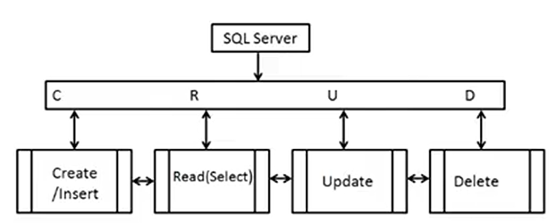

# CRUD with Docker - SQLAlchemy - Streamlit - FastAPI - SQLModel - Pydantic

## What is a CRUD?

Application that does operations os Create, Red, Update, Delete in a database

## Example of CRUD

This is the workflow that I'll be applying in this project

## ORM

Object Relationship Manager
